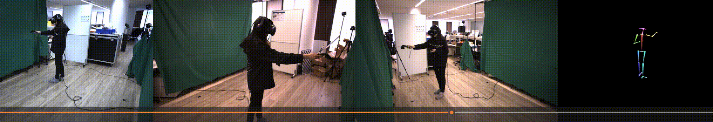
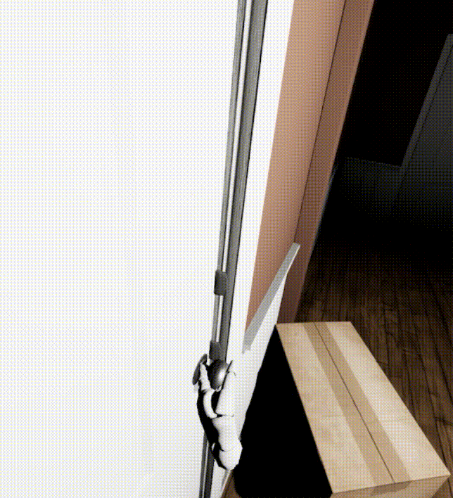
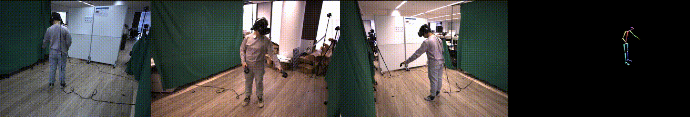

# VRMN-bD
## VRMN-bD: A Multi-modal Natural Behavior Dataset of Immersive Human Fear Responses in VR Stand-up Interactive Games [[arXiv]](https://arxiv.org/)
### He Zhang1,2, Xinyang Li3, Yuanxi Sun4, Xinyi Fu1, Christine Qiu5, and John M. Carroll2

1 The Future Laboratory, Tsinghua University

2 College of Information Sciences and Technology, Penn State University

3 Academy of Arts & Design, Tsinghua University

4 School of Computer and Cyber Sciences, Communication University of China

5 School of Electrical Engineering and Computer Science, The KTH Royal Institute of Technology

#### @[IEEE VR 2024](https://ieeevr.org/2024/)

---
About this GitHub repository - This GitHub repository is for the dataset, pre-trained models, and demonstrations proposed in "**VRMN-bD: A Multi-modal Natural Behavior Dataset of Immersive Human Fear Responses in VR Stand-up Interactive Games**".

  
  

  
  

  
  

| Model          | Task               | Accuracy | Recall  | F1     |
|----------------|--------------------|----------|---------|--------|
| LSTM           | 6-classification   | 60.22%   | 59.69%  | 61.34% |
| LSTM+attention | 6-classification   | 59.41%   | 60.20%  | 62.34% |
| BLSTM          | 6-classification   | 61.90%   | 61.74%  | 63.96% |
| BLSTM+attention| 6-classification   | 65.31%   | 65.31%  | 67.46% |
| LSTM           | 2-classification   | 90.47%   | 90.47%  | 90.47% |
| BLSTM+attention| 2-classification   | 76.96%   | 82.65%  | 83.09% |

### Description
Dataset - The VRMN-bD dataset is a Multi-modal Natural Behavior Dataset of Immersive Human Fear Responses in VR Stand-up Interactive Games, including 3D human skeletal point data, digital audio signals, physiological signal (heart beat and breath rate) data, and emotional (fear) annotations.

`/data_model/`
- **Description**: This folder contains the feature data for the project.
- **Contents**:  
    1. &nbsp;***dataset.json.gz***: Compressed dataset sequence [1.json.gz, 2.json.gz, ...] with all the features.  
    2. &nbsp;***data_model_description.md***: A markdown file explaining each feature in detail.

`/models/`
- **Description**: This folder contains the pre-trained model.
- **Contents**:  
    1. &nbsp;***sen_model_6classes_65.310.pkl***: Pre-trained model for 6 levels of fear.  
