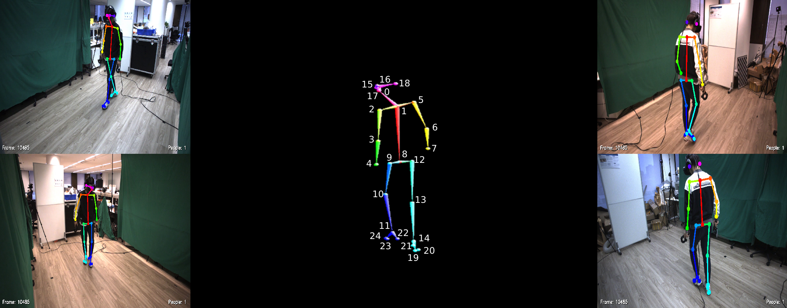
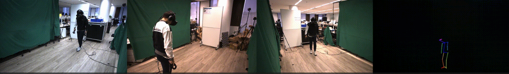

# VRMN-bD
## VRMN-bD: A Multi-modal Natural Behavior Dataset of Immersive Human Fear Responses in VR Stand-up Interactive Games [[arXiv]](https://arxiv.org/)
### He Zhang1,2, Xinyang Li3, Yuanxi Sun4, Xinyi Fu1, Christine Qiu5, and John M. Carroll2

1 The Future Laboratory, Tsinghua University

2 College of Information Sciences and Technology, Penn State University

3 Academy of Arts & Design, Tsinghua University

4 School of Computer and Cyber Sciences, Communication University of China

5 School of Electrical Engineering and Computer Science, The KTH Royal Institute of Technology

#### @[IEEE VR 2024](https://ieeevr.org/2024/)

---
About this GitHub repository - This GitHub repository is for the dataset, pre-trained models, and demonstrations proposed in "**VRMN-bD: A Multi-modal Natural Behavior Dataset of Immersive Human Fear Responses in VR Stand-up Interactive Games**".

  
  

  

