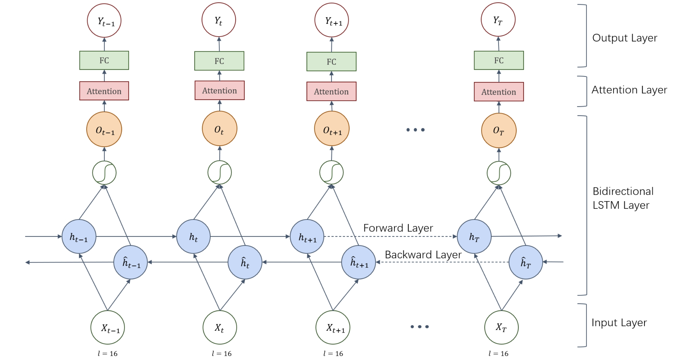

# VRMN-bD
## VRMN-bD: A Multi-modal Natural Behavior Dataset of Immersive Human Fear Responses in VR Stand-up Interactive Games [[arXiv]](https://arxiv.org/)
### He Zhang1,2, Xinyang Li3, Yuanxi Sun4, Xinyi Fu1, Christine Qiu5, and John M. Carroll2

1 The Future Laboratory, Tsinghua University

2 College of Information Sciences and Technology, Penn State University

3 Academy of Arts & Design, Tsinghua University

4 School of Computer and Cyber Sciences, Communication University of China

5 School of Electrical Engineering and Computer Science, The KTH Royal Institute of Technology

#### @[IEEE VR 2024](https://ieeevr.org/2024/)

---
## Description
About this GitHub repository - This GitHub repository is for the dataset, pre-trained models, and demonstrations proposed in "**VRMN-bD: A Multi-modal Natural Behavior Dataset of Immersive Human Fear Responses in VR Stand-up Interactive Games**".

Figure 1. Human skeletal point calibration. Four Filr camera views (on two sides) and 3-D reconstructed skeletal point view (in the center).

## Experimental Demos

  
  

  
  

  
  

## Performance of Dataset
### 6-classification

|           | Non-fear           |                   |                   | Fear              |                   |                   |                   |
|-----------|--------------------|-------------------|-------------------|-------------------|-------------------|-------------------|-------------------|
|           | 0                  | 1                 | 2                 | 3                 | 4                 | 5                 | Total             |
| Count     | 526281             | 284204            | 78099             | 31466             | 10202             | 427               | 967079            |
| Ratio     | 58.18%             | 29.39%            | 8.08%             | 3.25%             | 1.05%             | 0.04%             | 100%              |
| Heart rate|                    |                   |                   |                   |                   |                   |                   |
| Mean      | 94.39              | 97.42             | 97.26             | 98.09             | 104.30            | 92.62             |                   |
| Std       | 17.11              | 17.50             | 17.92             | 16.15             | 21.24             | 4.80              |                   |
| Breath rate |                  |                   |                   |                   |                   |                   |                   |
| Mean      | 15.89              | 16.71             | 17.82             | 17.91             | 18.38             | 16.86             |                   | 
| Std       | 5.61               | 5.24              | 5.77              | 5.74              | 5.73              | 5.31              |                   |
| Acceleration |                 |                   |                   |                   |                   |                   |                   |
| Mean      | 0.28               | 0.09              | 0.09              | 0.09              | 0.12              | 0.12              |                   |
| Std       | 51.08              | 0.28              | 0.57              | 0.07              | 0.55              | 0.12              |                   |

### 2-classification

|           | Non-fear           |                   | Fear              |                   | Total             |
|-----------|--------------------|-------------------|-------------------|-------------------|-------------------|
|           | 0                  |                   | 1                 |                   |                   |
| Count     | 526281             |                   | 404398            |                   | 967079            |
| Ratio     | 58.18%             |                   | 41.82%            |                   | 100%              |
| Heart rate|                    |                   |                   |                   |                   |
| Mean      | 94.39              |                   | 97.61             |                   |                   |
| Std       | 17.11              |                   | 17.61             |                   |                   |
| Breath rate |                  |                   |                   |                   |                   |
| Mean      | 15.89              |                   | 17.06             |                   |                   |
| Std       | 5.61               |                   | 5.42              |                   |                   |
| Acceleration |                 |                   |                   |                   |                   |
| Mean      | 0.28               |                   | 0.09              |                   |                   |
| Std       | 51.08              |                   | 0.35              |                   |                   |

## Performance of Models
| Model          | Task               | Accuracy | Recall  | F1     |
|----------------|--------------------|----------|---------|--------|
| LSTM           | 6-classification   | 60.22%   | 59.69%  | 61.34% |
| LSTM+attention | 6-classification   | 59.41%   | 60.20%  | 62.34% |
| BLSTM          | 6-classification   | 61.90%   | 61.74%  | 63.96% |
| BLSTM+attention| 6-classification   | 65.31%   | 65.31%  | 67.46% |
| LSTM           | 2-classification   | 90.47%   | 90.47%  | 90.47% |
| BLSTM+attention| 2-classification   | 76.96%   | 82.65%  | 83.09% |

## Bidirectional LSTM + Attention Model for Multi-modal Fear Prediction

  

Figure2. The architecture of BLSTM+attention model. Xt , Yt indicate the input and output on step t of the model. ht and ˆht stand for the hidden states of forward layer and backward layer for each step. Ot is the corresponding output of BLSTM model.

## Usage
Dataset - The VRMN-bD dataset is a Multi-modal Natural Behavior Dataset of Immersive Human Fear Responses in VR Stand-up Interactive Games, including 3D human skeletal point data, digital audio signals, physiological signal (heart beat and breath rate) data, and emotional (fear) annotations.

`/data_model/`
- **Description**: This folder contains the feature data for the project.
- **Contents**:  
    1. &nbsp;***dataset.json.gz***: Compressed dataset sequence [1.json.gz, 2.json.gz, ...] with all the features.  
    2. &nbsp;***data_model_description.md***: A markdown file explaining each feature in detail.

`/models/`
- **Description**: This folder contains the pre-trained model.
- **Contents**:  
    1. &nbsp;***sen_model_6classes_65.310.pkl***: Pre-trained model for 6 levels of fear.  

## Citation

Please cite the following paper in your publications if our data, models ,and/or paper help your research.

> @misc{zhang2024vrmnbd,
      title={VRMN-bD: A Multi-modal Natural Behavior Dataset of Immersive Human Fear Responses in VR Stand-up Interactive Games}, 
      author={He Zhang and Xinyang Li and Yuanxi Sun and Xinyi Fu and Christine Qiu and John M. Carroll},
      year={2024},
      eprint={2401.12133},
      archivePrefix={arXiv},
      primaryClass={cs.HC}
}

## License

This project is licensed under the [MIT License](LICENSE).

See the [LICENSE](LICENSE) file for details.
